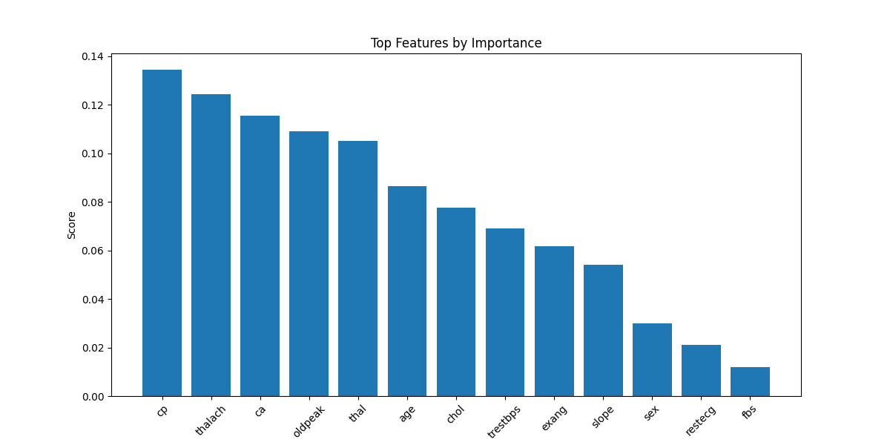
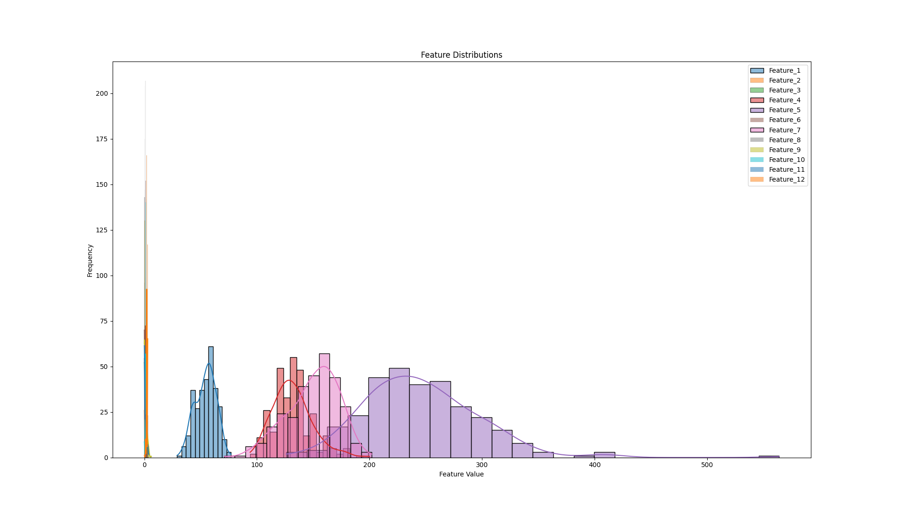
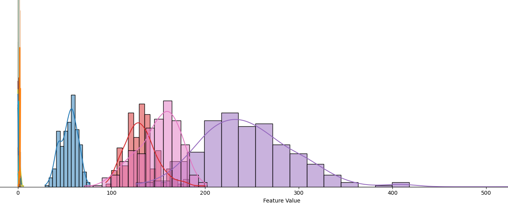

<h1 align="center">📊 Feature Selector Tool</h1>

  
  

<h2>🚀 Overview</h2>

<b>Feature Selector Tool</b> is a Python application designed for <b>automatic feature selection</b> in machine learning datasets.  
It handles missing values, encodes categorical variables, analyzes feature importance, and offers powerful insights through visualizations — supporting both <b>classification</b> and <b>regression</b> tasks.

<h2>🛠️ Key Features</h2>

<ul>
  <li><b>Automatic Handling of Missing Values</b></li>
  <li><b>Automatic Detection and Encoding of Categorical Variables</b></li>
  <li><b>Insights into Feature Importance and Distribution</b></li>
  <li><b>Support for both CSV and TXT datasets</b></li>
  <li><b>Designed for classification and regression workflows</b></li>
</ul>

<h2>📈 Visualizations</h2>

The Feature Selector Tool includes powerful visualization methods to inspect dataset characteristics:

<h3>🔹 Feature Importance</h3>

<h3>🔹 Feature Distribution</h3>

<h2>🏗️ Usage</h2>

<pre>
1. Navigate to the project directory:
   cd feature_selection_tool

2. Run the tool:
   python main.py

3. Choose a dataset using the file explorer when prompted.

4. Follow the on-screen instructions to perform feature selection.
</pre>

<h2>📦 Prerequisites</h2>

<ul>
  <li>Python >= 3.7</li>
  <li>pandas == 2.1.2</li>
  <li>numpy == 1.26.1</li>
  <li>scikit-learn == 1.3.2</li>
  <li>feature-engine == 1.6.2</li>
  <li>torch == 2.1.0</li>
  <li>matplotlib == 3.8.1</li>
  <li>seaborn == 0.13.0</li>
</ul>

Install all requirements via:

<pre>
pip install -r requirements.txt
</pre>

<h2>⚡ Limitations</h2>

<ul>
  <li><b>Large Datasets:</b> May cause memory or computation issues. Consider subsampling large datasets.</li>
  <li><b>Outliers:</b> Recommend preprocessing to handle outliers before using the tool.</li>
  <li><b>Dataset Characteristics:</b> Some datasets may require extra preprocessing depending on complexity.</li>
</ul>

<h2>🔮 Future Improvements</h2>

<ul>
  <li>Enhanced support for large datasets</li>
  <li>Improved outlier detection and handling</li>
  <li>Expanded visualization capabilities</li>
</ul>

👉 Feel free to check our <a href="CONTRIBUTING.md">Contributing Guidelines</a> if you'd like to suggest improvements or contribute!

<h2>📂 Tested Datasets</h2>

<table>
<thead>
<tr><th>Dataset</th><th>Description</th><th>Link</th></tr>
</thead>
<tbody>
<tr><td>Heart Disease Dataset</td><td>Features related to patient heart health.</td><td><a href="#">Dataset Link</a></td></tr>
<tr><td>Diabetes Dataset</td><td>Health indicators for diabetes prediction.</td><td><a href="#">Dataset Link</a></td></tr>
<tr><td>Health Stroke Dataset</td><td>Features related to stroke prediction.</td><td><a href="#">Dataset Link</a></td></tr>
<tr><td>MovieLens Dataset</td><td>Movie recommendation system data.</td><td><a href="#">Dataset Link</a></td></tr>
</tbody>
</table>

<h2>🤝 Acknowledgements</h2>

Special thanks to all contributors and users who have helped test and improve the Feature Selector Tool!

<h2>📬 Contact</h2>

<ul>
  <li><b>Author:</b> [Your Name]</li>
  <li><b>Email:</b> [your.email@example.com]</li>
  <li><b>GitHub:</b> [Your GitHub Profile]</li>
</ul>

<b>🎯 Making feature selection easier, smarter, and faster for all machine learning workflows!</b>

