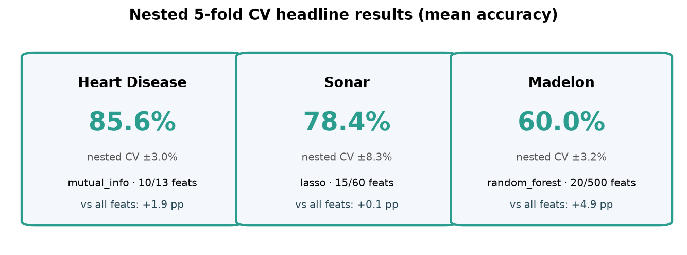
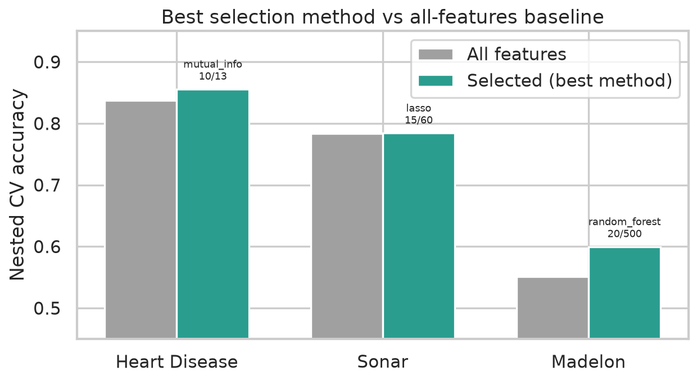
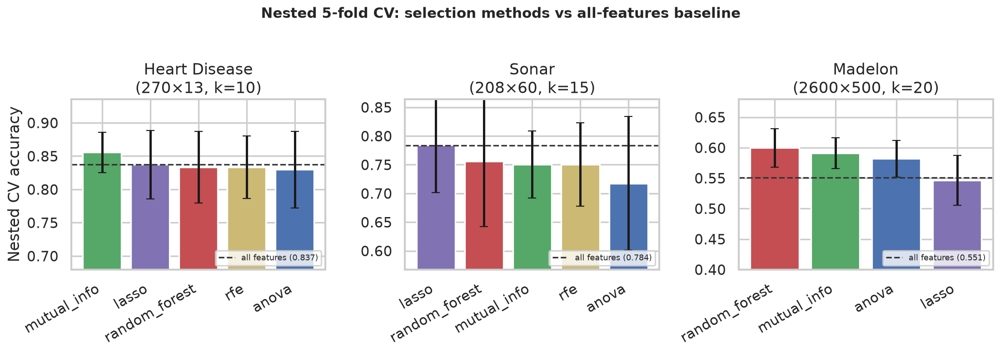
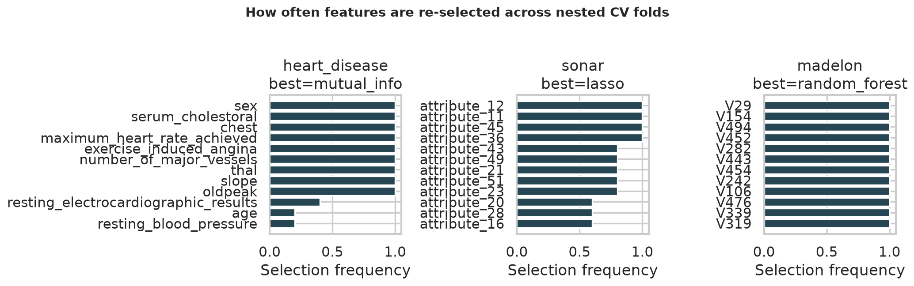
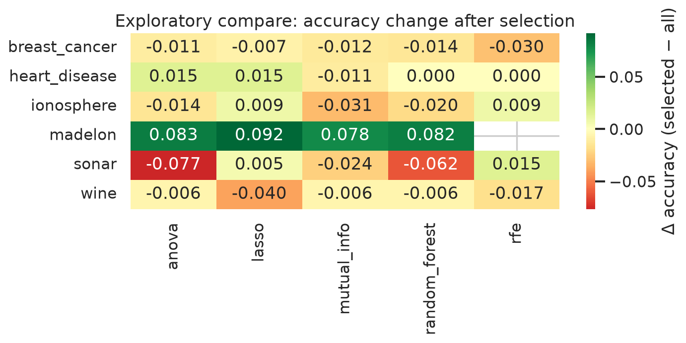

# Feature Selector Tool

**Leakage-safe multi-method feature selection for tabular ML** — with research-grade comparisons, stability analysis, and nested cross-validation.


<p align="center">
  
</p>

Select fewer features **without peeking at the test set**, compare ANOVA / mutual information / Random Forest / Lasso / RFE side by side, and report **mean ± std** accuracy from nested CV.

---

## Why this exists

Most demos fit `SelectKBest` on the full dataset, then split — that **leaks labels** into selection and inflates accuracy. This tool is built so researchers and practitioners can:

1. **Compare methods fairly** on the same data and baseline model  
2. **Measure stability** (do the same features reappear across folds?)  
3. **Report nested CV** numbers suitable for a thesis or paper  
4. **Export artifacts** (CSV, JSON, HTML, plots) in one command  

---

## Benchmark results (reproduced in this repo)

We evaluated three public classification datasets that span **clinical**, **mid-dimensional**, and **high-dimensional noisy** regimes.

| Dataset | Samples × features | k selected | Protocol |
|---------|-------------------:|-----------:|----------|
| [Heart Disease (Statlog)](https://www.openml.org/d/53) | 270 × 13 | 10 | Nested 5-fold CV |
| [Sonar](https://www.openml.org/d/40) | 208 × 60 | 15 | Nested 5-fold CV |
| [Madelon](https://www.openml.org/d/1485) (NIPS FS challenge) | 2 600 × 500 | 20 | Nested 5-fold CV |

**Protocol:** on each outer train fold, fit the selector + logistic regression baseline; score on the held-out outer fold. Feature choice never sees the outer test labels. Random seed `42`.

### Nested CV — best method vs all features

| Dataset | Best method | Selected accuracy | All-features accuracy | Lift | Compression |
|---------|-------------|------------------:|----------------------:|-----:|------------|
| **Heart Disease** | mutual_info | **85.6% ± 3.0%** | 83.7% ± 5.5% | **+1.9 pp** | 10 / 13 |
| **Sonar** | lasso | **78.4% ± 8.3%** | 78.4% ± 1.7% | ~0 pp | **15 / 60** (4× fewer) |
| **Madelon** | random_forest | **60.0% ± 3.2%** | 55.1% ± 1.3% | **+4.9 pp** | **20 / 500** (25× fewer) |

<p align="center">
  
</p>

**Takeaways**

- **Madelon** (many noise features): selection **helps accuracy** and massively compresses the model.  
- **Heart Disease**: modest accuracy gain with a **smaller clinical feature set** — useful for interpretability.  
- **Sonar**: accuracy holds while using **¼ of the features** — a pure compression win under nested CV.

> Exploratory “fit selection on full data then CV” tables can look more optimistic (especially on Madelon). Prefer the **nested** numbers above for claims.

### Full nested CV leaderboard (all methods)

<p align="center">
  
</p>

#### Heart Disease (k = 10)

| Method | Mean acc | Std | Mean F1 | Selection frequency* |
|--------|---------:|----:|--------:|---------------------:|
| **mutual_info** | **0.856** | 0.030 | 0.855 | 0.83 |
| lasso | 0.837 | 0.051 | 0.836 | 0.91 |
| random_forest | 0.833 | 0.054 | 0.832 | 0.91 |
| rfe | 0.833 | 0.047 | 0.832 | 0.83 |
| anova | 0.830 | 0.058 | 0.829 | 0.91 |

#### Sonar (k = 15)

| Method | Mean acc | Std | Mean F1 | Selection frequency* |
|--------|---------:|----:|--------:|---------------------:|
| **lasso** | **0.784** | 0.083 | 0.783 | 0.58 |
| random_forest | 0.756 | 0.114 | 0.754 | 0.63 |
| mutual_info | 0.750 | 0.058 | 0.749 | 0.47 |
| rfe | 0.750 | 0.072 | 0.749 | 0.68 |
| anova | 0.717 | 0.117 | 0.716 | 0.75 |

#### Madelon (k = 20)

| Method | Mean acc | Std | Mean F1 | Selection frequency* |
|--------|---------:|----:|--------:|---------------------:|
| **random_forest** | **0.600** | 0.032 | 0.599 | 0.87 |
| mutual_info | 0.591 | 0.025 | 0.591 | 0.26 |
| anova | 0.582 | 0.030 | 0.582 | 0.61 |
| lasso | 0.546 | 0.041 | 0.546 | 0.36 |

\*Mean selection frequency among features chosen at least once across outer folds (higher ≈ more stable subset).

<p align="center">
  
</p>

### Exploratory multi-dataset scan (9 benchmarks)

Before nested CV, we also ran method comparison on nine catalog datasets (before/after CV metrics). Useful for **screening**; not a substitute for nested CV.

<p align="center">
  
</p>

Largest exploratory gains appeared on **Madelon**, **Sonar**, **Heart Disease**, and **Ionosphere** — consistent with the nested story that selection matters when noise or redundancy is high.

Raw tables and HTML reports:  
`examples/benchmark_out/` · `examples/nested_cv_out/`

Reproduce:

```bash
pip install -e ".[dev]"
feature-select datasets download heart_disease sonar madelon --out data

# exploratory compare
python examples/benchmark_datasets.py \
  --datasets heart_disease,sonar,madelon --k 10 --out examples/benchmark_out

# nested CV (paper numbers)
feature-select nested-cv data/heart_disease.csv -k 10 --method mutual_info --cv 5 --out results/heart_ncv
feature-select nested-cv data/sonar.csv -k 15 --method lasso --cv 5 --out results/sonar_ncv
feature-select nested-cv data/madelon.csv -k 20 --method random_forest --cv 5 --out results/madelon_ncv
```

---

## Install

```bash
git clone https://github.com/HystonKayange/Feature-Selection-Tool.git
cd Feature-Selection-Tool
python -m venv .venv && source .venv/bin/activate
pip install -e ".[dev]"
# optional
pip install -e ".[ui]"     # Streamlit
pip install -e ".[docs]"   # MkDocs
```

---

## 30-second example

```python
from feature_selector import load_benchmark, compare_methods, nested_cv_compare_methods

X, y, info = load_benchmark("heart_disease")  # caches CSV under ./data
print(info.name, X.shape)

# Side-by-side methods + stability + Jaccard
cmp = compare_methods(X, y, k=10, task="classification", cv=5)
print(cmp.summary)
cmp.export("results/heart_compare")

# Unbiased ranking for papers
print(nested_cv_compare_methods(X, y, k=10, outer_splits=5))
```

---

## CLI

| Command | Purpose |
|---------|---------|
| `feature-select datasets list` | Recommended public datasets |
| `feature-select datasets download … --out data` | Cache CSVs (target = last column) |
| `feature-select run DATA -k K --method rf --out DIR` | Single method + hold-out |
| `feature-select compare DATA -k K --out DIR` | Multi-method research table |
| `feature-select stability DATA -k K --out DIR` | Fold selection frequencies |
| `feature-select nested-cv DATA -k K --method M --out DIR` | Nested CV (mean ± std) |
| `feature-select ui` | Streamlit research UI |

```bash
feature-select datasets list --goal medical
feature-select compare data/sonar.csv -k 15 --out results/sonar
feature-select nested-cv data/madelon.csv -k 20 --method random_forest --out results/madelon_ncv
```

---

## Methods

| Name | Family | Typical strength |
|------|--------|------------------|
| `anova` / `f_score` | Filter | Fast, strong on clean linear signals |
| `mutual_info` / `mi` | Filter | Nonlinear dependency (e.g. heart disease here) |
| `random_forest` / `rf` | Model-based | Robust on noisy high-dim (Madelon) |
| `lasso` | Model-based / embedded | Sparse linear subsets (Sonar) |
| `rfe` | Wrapper | Accurate but slower on wide data |

---

## What “correct” means here

| Concern | Behavior |
|---------|----------|
| Leakage | Split / outer folds **before** fitting selectors |
| Targets | Missing labels **dropped**, never imputed |
| Features | Impute / encode using **train** statistics only |
| Names | Real column names preserved after selection |
| Reporting | Nested CV for claims; exploratory compare for screening |

---

## Project layout

```text
feature_selector/
  selector.py       # multi-method FeatureSelector
  compare.py        # method comparison + export
  stability.py      # CV stability
  nested_cv.py      # nested cross-validation
  evaluate.py       # before/after metrics
  datasets.py       # catalog + download
  streamlit_app.py  # research UI
  cli.py
docs/               # MkDocs pages
examples/
  benchmark_datasets.py
  benchmark_out/    # exploratory results
  nested_cv_out/    # nested CV tables used above
Images/results/     # figures in this README
tests/              # 56 tests
```

---

## Documentation

- [docs/datasets.md](docs/datasets.md) — which datasets to download and why  
- [docs/research.md](docs/research.md) — evaluation ladder for papers  
- [docs/api.md](docs/api.md) — API overview  
- [CHANGELOG.md](CHANGELOG.md)

```bash
pip install -e ".[docs]" && mkdocs serve
```

---

## Tests

```bash
pytest tests/ -q
```

---

## Limitations

- Tabular CSV/TXT only  
- Nested CV and wide data (Madelon) are slower — start with Heart/Sonar  
- Lasso may warn about non-convergence on some folds; accuracy still reported  
- OpenML download needs network the first time  

---

## Citation / reproducibility

If you use this tool in a paper or thesis, please cite the repository and note:

- package version **0.4.0**  
- seed **42**  
- nested **5-fold** CV  
- baseline: `StandardScaler` + `LogisticRegression`  
- tables above generated from `examples/nested_cv_out/nested_cv_all.csv`

---

## License

MIT — see [LICENSE](LICENSE).
